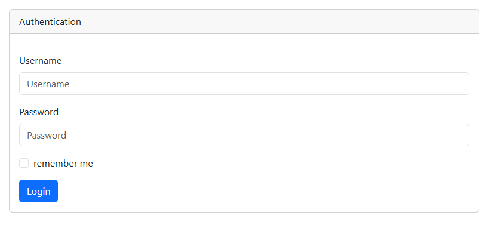
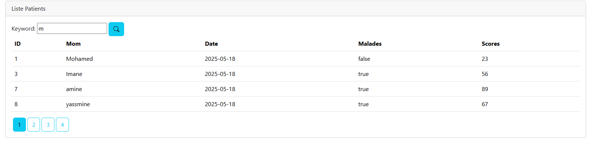
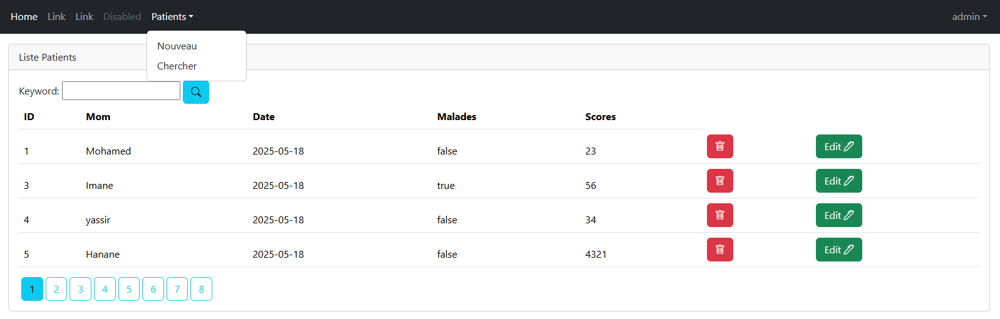
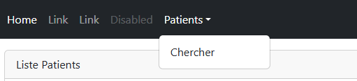

# Briwa Hospital Management System

Briwa Hospital is a basic hospital management system built to manage essential operations such as patient registration, staff handling, and appointment scheduling. The project uses Java and standard frontend technologies.

## Features

* Patient Registration and Management
* Doctor and Staff Management
* Appointment Scheduling
* Basic UI with HTML interfaces

## Technologies Used

* Java
* HTML
* Java Swing (for GUI)
* JDBC (for database connection)
* MySQL (Database)

## Getting Started

### Prerequisites

* Java JDK 8 or higher
* MySQL Server
* An IDE such as IntelliJ IDEA or Eclipse

### Installation

1. **Clone the Repository:**

   ```bash
   git clone https://github.com/BR1WA/briwa-hospital.git
   ```

2. **Import the project** into your preferred IDE as a Java project.

3. **Set up the Database:**

   * Create a new MySQL database (e.g., `hospital_db`).
   * Import the provided SQL schema if available (check the repo for `.sql` files).
   * Update the database connection credentials in the Java code (look for JDBC URL, username, and password).

4. **Run the Application:**

   * Locate the main Java class (e.g., `Main.java`) and run it.

## Project Structure

```
/ briwa-hospital
|-- /src
|   |-- Main.java
|   |-- /views
|   |-- /controllers
|   |-- /models
|-- /resources
|-- README.md
```

## Screenshots

Below are some screenshots demonstrating the functionality of the Briwa Hospital Management System:

### 1. Login Interface



### 2. Dashboard



### 3. Patient list



### 4. Patient search 



### 5. Patient Management


## Author

Created by [@BR1WA](https://github.com/BR1WA)
